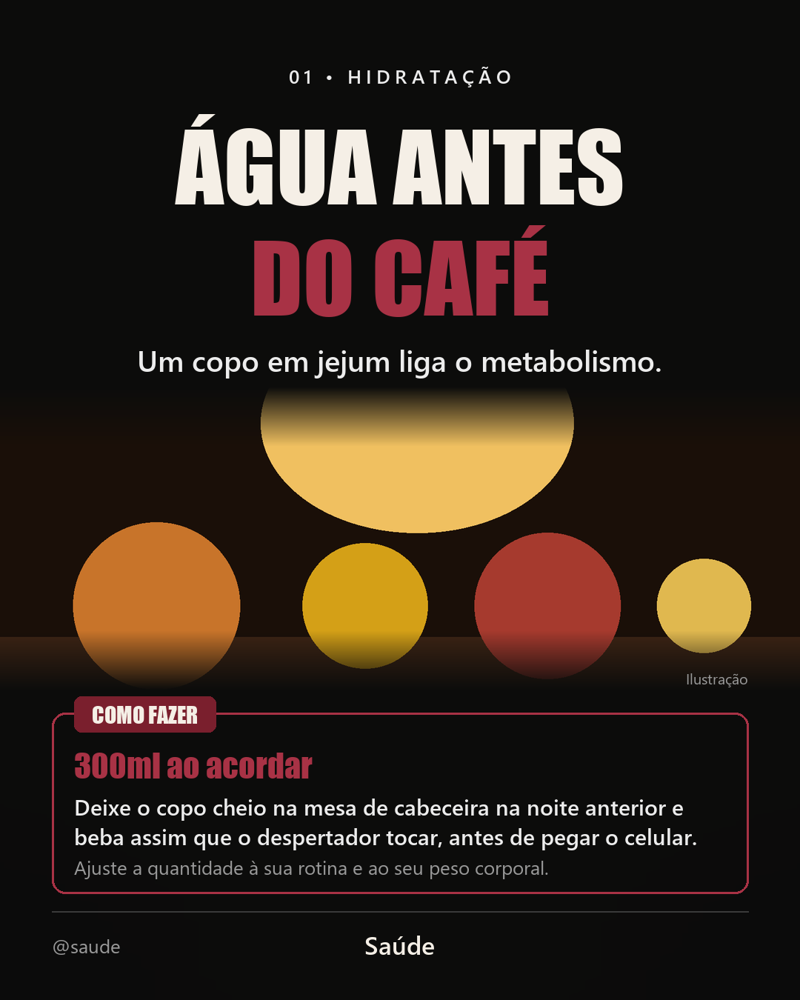
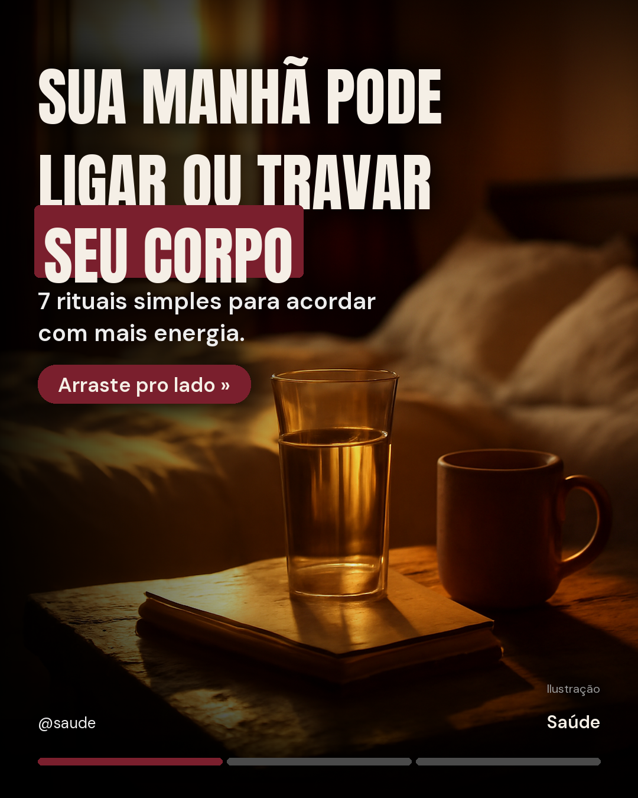
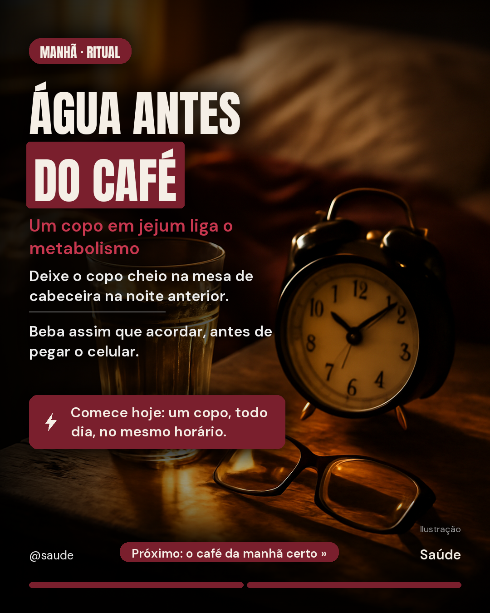

# 🎠 Skill de Carrossel para Instagram (Claude Code)

Uma **skill de Claude Code** que executa, de ponta a ponta, um roteiro profissional de
criação de carrosséis para Instagram: define paleta com você, pesquisa temas em alta no
seu nicho, estrutura 7–9 lâminas com lógica de engajamento, gera as imagens por IA
(OpenAI `gpt-image-1`) e monta as artes finais 1080×1350 prontas para postar.

O estilo foi calibrado em carrosséis reais de alto engajamento e vem em **dois modelos**:

| Modelo 1 — Vitrine | Modelo 2 — Imersivo (capa) | Modelo 2 — Imersivo (conteúdo) |
|---|---|---|
|  |  |  |

*(exemplos reais: imagens geradas com gpt-image-1 em qualidade `low` e montadas pela skill)*

- **Modelo 1 — Vitrine:** texto centralizado, imagem 3D estilo "peça de museu", caixa de
  instrução "COMO FAZER". Ideal para conteúdo útil: ferramentas, dicas, tutoriais.
- **Modelo 2 — Imersivo:** imagem cinematográfica cobrindo a lâmina inteira, texto em
  coluna à esquerda, teaser "Próximo: ... »" e barra de progresso. Ideal para
  storytelling e temas emocionais.

## Como instalar

Requisitos: [Claude Code](https://claude.com/claude-code) e Python 3.10+ com Pillow
(`pip install pillow`).

**Opção A — usar neste projeto:** clone o repositório e abra a pasta no Claude Code.
A skill (em `.claude/skills/carrossel-instagram/`) é detectada automaticamente.

```bash
git clone https://github.com/lecas456/carrossel-instagram-skill.git
cd carrossel-instagram-skill
claude
```

**Opção B — usar em qualquer projeto:** copie a pasta `.claude/skills/carrossel-instagram/`
para dentro do seu projeto, ou para `~/.claude/skills/` (fica disponível em todos os projetos).

## Como usar

Abra o Claude Code e peça, por exemplo:

> cria um carrossel para o meu perfil

O Claude vai seguir o roteiro da skill:

1. **Paleta** — confirma as cores (padrão: fundo preto + destaque vinho; ele pode extrair a cor da sua logomarca).
2. **Tema** — pesquisa na internet assuntos em alta e datas comemorativas do seu nicho e sugere temas.
3. **Estrutura** — pergunta o objetivo (seguidores, venda, salvamentos...), escolhe o modelo visual com você e monta o roteiro lâmina a lâmina para sua aprovação.
4. **Prompts** — escreve um prompt de imagem profissional por lâmina.
5. **Imagens** — gera via API da OpenAI (veja "Chave da API" abaixo). Sem chave, produz versões só tipográficas.
6. **Montagem** — compõe as artes finais 1080×1350 com Pillow.
7. **Entrega** — organiza tudo em uma pasta com o nome do tema e sugere legenda com hashtags.

## Chave da API (opcional, para gerar imagens)

Crie um arquivo `.env` na raiz do projeto:

```
OPENAI_API_KEY=sk-...
```

Custo médio por carrossel de 9 lâminas (gpt-image-1, 1024×1536): **≈ US$ 0,14** na
qualidade `low` (padrão) ou ≈ US$ 0,57 em `medium`. A skill rascunha em `low` e só propõe
`medium` se você pedir mais qualidade.

## Fontes

Já vêm incluídas na pasta `fonts/` da skill (licença SIL OFL, uso comercial liberado):
[Anton](https://fonts.google.com/specimen/Anton) para títulos e destaques e
[DM Sans](https://fonts.google.com/specimen/DM+Sans) para os textos secundários.
Nada para instalar — e dá para trocar a tipografia colocando outros `.ttf` na mesma pasta.

## Estrutura

```
.claude/skills/carrossel-instagram/
  SKILL.md                      # o roteiro que o Claude executa
  references/estilo-visual.md   # anatomia dos 2 modelos + templates de prompt
  scripts/gerar_imagem.py       # geração de imagem via OpenAI (só stdlib)
  scripts/montar_slide.py       # montagem das lâminas 1080x1350 (Pillow)
  fonts/                        # fontes opcionais (prioridade sobre o sistema)
exemplos/                       # lâminas de demonstração
```

Os scripts também funcionam sozinhos, sem Claude:

```bash
python .claude/skills/carrossel-instagram/scripts/gerar_imagem.py --prompt "..." --out imagens/01.png
python .claude/skills/carrossel-instagram/scripts/montar_slide.py MeuTema/slides.json
```

O formato do `slides.json` está documentado no topo de `montar_slide.py` e com exemplos
em `references/estilo-visual.md`.
